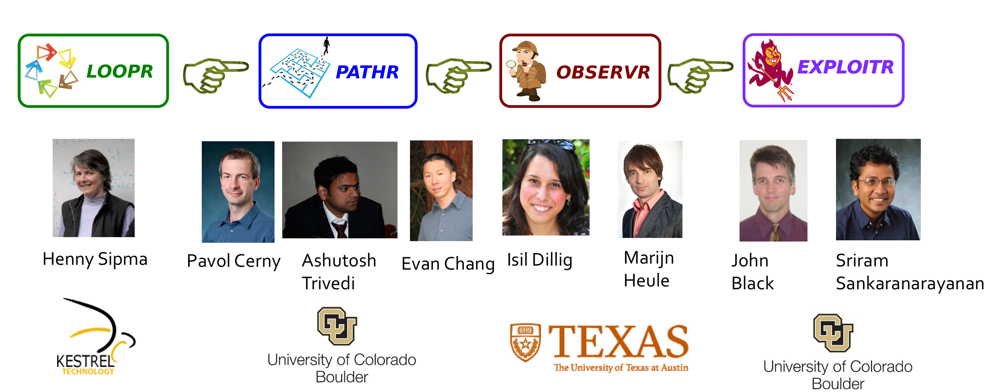
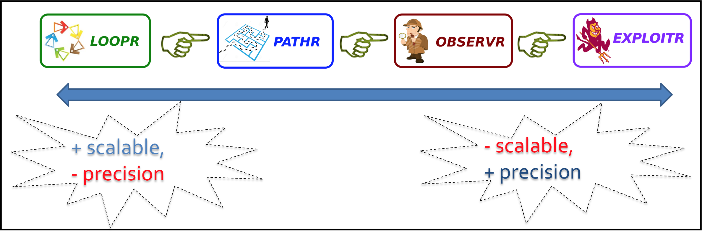
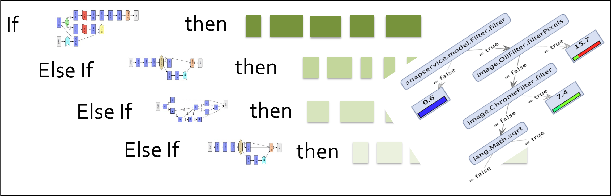

# Welcome to Auditr Project Website  

The fundamental goal of the Auditr system is to allow analysts to  quickly and reliably 
pinpoint Java applications with exploitable security vulnerabilities.  Specifically, 
Auditr will focus on two kinds of security vulnerabilities related to space and 
time usage of programs:

1. **Availability problems**: which arise when a user-provided input controls the 
   asymptotic complexity or termination of a program component. Since attackers can 
   substantially degrade system performance through carefully selected inputs, 
   availability problems can be exploited by malicious parties to launch denial of service 
   attacks.

2. **Confidentiality problems**: which arise when two different user inputs result in 
   substantially different resource usage behaviors depending on the value of some 
   confidential data stored in the system.  If the program exhibits substantially different 
   space or time usage characteristics depending on user input, attackers can exploit 
   this behavior to learn confidential information through side channel attacks.

Auditr’s key goal in identifying availability and confidentiality problems is to minimize both false positives and false negatives. In addition, every identified potential security vulnerability should be accompanied by sufficient evidence to convince a human analyst of the exploitable nature of the vulnerability. Auditr will need to overcome a multitude of technical challenges to attain the goals described above. Specifically, the members of the Auditr's team will address the following key research problems: _Trade-off between precision, soundness, and scalability_, _Analysis of asymptotic resource usage behavior_, _Analysis of sanitization code_, _Providing evidence to analysts_. 

The following figure shows the workflow of Auditr which has four components: LOOPR, PATHR, OBSERVR, and EXPLOITR. 

 

Below we explain the key ideas underlying each of these components: 

1. **Loopr**. The LOOPR component will perform a conservative and highly scalable static analysis of all relevant byte code to identify all vulnerable algorithmic components. Since the aim of LOOPR is to identify all possible resource usage vulnerabilities, soundness will be of primary concern and precision will be secondary. 

2. **Pathr**. The task of the PATHR component is to refine the results of LOOPR by performing a more precise path and context-sensitive static analysis. For instance, using a more precise interprocedural analysis, PATHR might determine that the component in question cannot be controlled by user input. 

3. **Observr**. The task of OBSERVR is to further refine the results of PATHR by performing solver guided static analysis. Specifically, OBSERVR will analyze sanitizers and determine the condition a user input must satisfy to reach the vulnerable component. 

4. **Exploitr**. The EXPLOITR component will further generalize the witnesses produced by OBSERVR and generate exploits similar to those that might be used by an attacker to launch denial of service or side channel attacks.  The results of EXPLOITR will be used to rank the detected vulnerabilities according to their threat level and further convince the analyst of the exploitable nature of the problem.

## Available Tools
In this section, we introduce tools developed to address Confidentiality and Availability vulnerabilities related to space and time (known as side-channel):

### Discriminer
This is a tool for program analysis of side-channel related to confidentiality vulnerabilities. The goal is to Discriminate program traces based on observable behaviors like time, memory, and network. This tool is a combination of dynamic analysis techniques and probabilistic machine learning approaches to analyze program confidentiality. In the first step, dynamic analysis techniques are applied to extract data set from a target application (data includes program internal features and observable behaviors like execution time). Next, probabilistic clustering techniques are applied to extract similarities between data records. Finally, a classification method is applied to learns a set of discrimination formulae which distinguish between traces based on observable behavior introduced in the data set. 
 

 
#### Publication
[Discriminating Traces with Time](https://arxiv.org/pdf/1702.07103.pdf), Saeid Tizpaz-Niari, Pavol Cerny, Bor-Yuh Evan Chang, Sriram Sankaranarayanan and Ashutosh Trivedi, Accepted in 23'rd International Conference on Tools and Algorithms for Construction and Analysis of Systems (TACAS'17).
##### GitHub source code available [here](https://github.com/cuplv/Discriminer)
##### Complete Introduction and Background: [README](Discriminer_README.pdf) 
 
### CONCERT
CONCERT (CONfidentiality CERTifier) is a modeling and verification framework for program confidentiality. More specifically, it is a verification tool to check transducer properties related to confidentiality properties. Programs specified as transducer models are inputs of CONCERT. Given the input model, the tool reduces the input transducer model to a set of SMT formulae using [Z3-SMT Solver](https://github.com/Z3Prover/z3) to check interesting properties. For example, we show that k-valued property of transducers is a way to quantified information leakage in given models. Therefore, we check k-valued property in given model using a set of Z3-SMT Solver to argue about existence/absence of confidentiality vulnerabilities. The tool checks 2-ambiguity, bounded k-valued, unbounded 1-valued, and unique-run properties. 

##### GitHub source code available [here](https://github.com/cuplv/CONCERT)
##### Complete Introduction and Background: [README](CONCERT_README.pdf)
 
### Authors and Contributors
 

### Support or Contact
 
